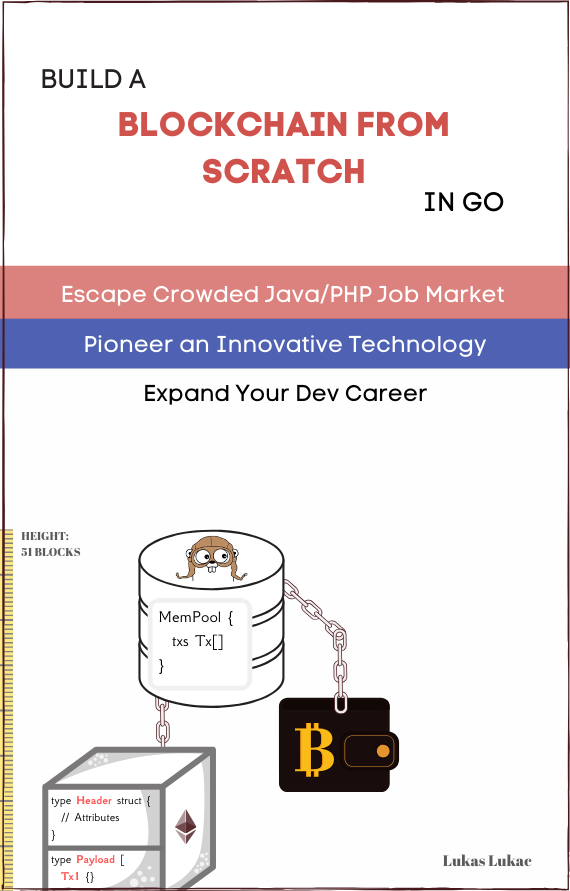
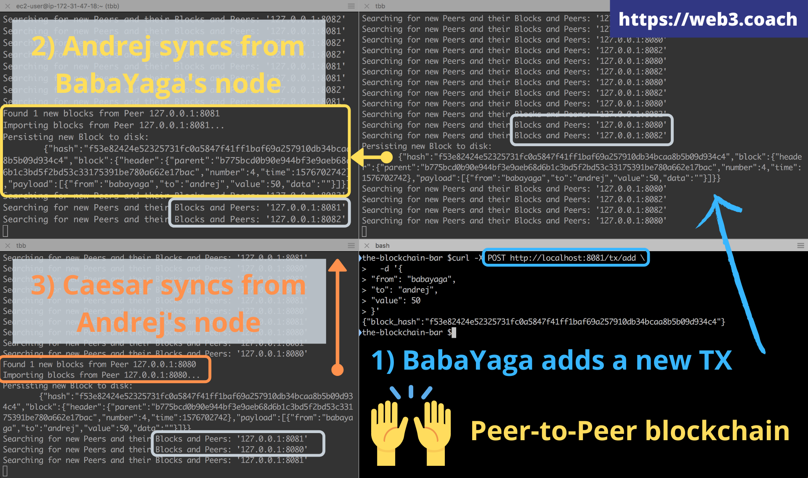
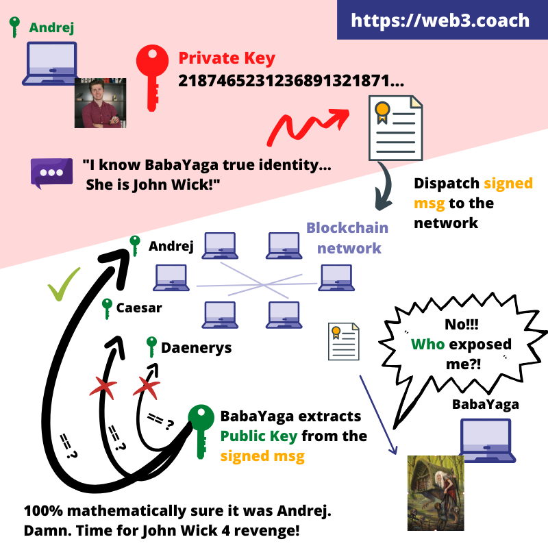
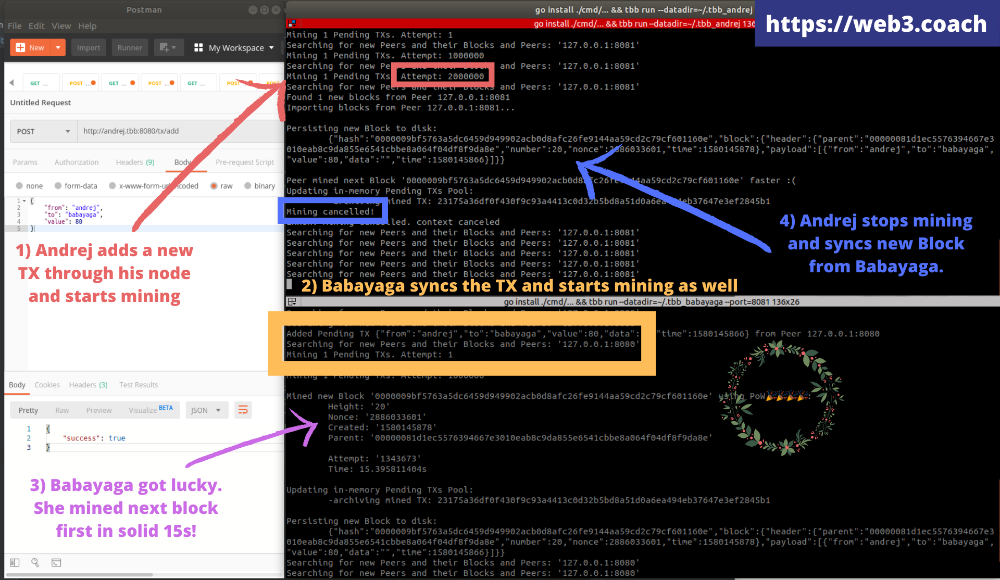

# The Blockchain Bar

> The source-code for the first 7 chapters of: "Build a Blockchain from Scratch in Go".

Download the eBook from: [https://web3.coach#book](https://web3.coach#book)



## Introduction

Hi :wave:,

With Web 3.0 and blockchain becoming more mainstream every day, do you know what blockchain is? Do you know its technical advantages and use-cases?

**The goal of this tutorial is to introduce blockchain technology from a technical perspective by building one from scratch.**

Forget everything you've heard about blockchain from social media. Now, you will build a blockchain system from ground zero to really understand the ins and outs of this peer-to-peer, distributed technology.

Afterwards, make your own mind up about its future, advantages and shortcomings. 

Spoiler alert: you will fall in love with programming blockchain software. :smiling_imp:

## How?

You will follow the story of a software developer who is looking to revolutionize his local bar by implementing blockchain technology for its payment system.

Although blockchain has several undeniable use-cases, at the moment, the number one application is payments. This is because banks are still running on an inefficient, 40 year old infrastructure powered by CSV files and FTP.

The story comes with a lot of fun and intriguing facts about the overall blockchain ecosystem and different protocols such as Bitcoin, Ethereum and XRP.

## What will you build?

Chapter by chapter, you will build a full peer-to-peer, autonomous blockchain system in Go and **learn all standard blockchain components!**

### 1) You will build a peer-to-peer system from scratch

You start with 0 lines of code and end-up with 13+ branches with complete executable source-code.

PS: Don't worry if anything on the screen makes sense yet, it will once you go chapter by chapter; release by release.



### 2) You will secure the system with a day-to-day practical cryptography

No boring theory. Only modern practices.



### 3) You will implement Bitcoin, Ethereum and XRP backend components 

From diagrams of mining algorithms to actual, implemented and working crypto wallets for storing the mined tokens and all other fundamental components that make blockchain special.



### 4) You will write unit tests and integration tests for all core components

You will test your cryptographic functions, a Bitcoin's like Proof of Work mining algorithm and other key components.


## How to use this repository
Every eBook chapter has a dedicated branch where you can experiment with the code first-hand.

```git
git branch

> c1_genesis_json
> c2_db_changes_txt
> c3_state_blockchain_component
> c4_caesar_transfer
> c5_broken_trust
> c6_immutable_hash
```

## Installation

[Open instructions.](./Installation.md)

## Getting started
1. Download the eBook from: [https://web3.coach#book](https://web3.coach#book)
1. Open the book at Chapter 1
1. Checkout the first chapter's branch `c1_genesis_json`

```git
git pull --all

git checkout c1_genesis_json
```

## TBB program usage
### CLI
Interacting with TBB blockchain using CLI.

### Show current program's version
```bash
tbb help
```

### Show blockchain balances of all bar's customers
```bash
tbb balances list
```

### Store a new TX in the DB
```bash
tbb tx add --from=andrej --to=babayaga --value=1000
```

### Store a new Reward TX in the DB
```bash
tbb tx add --from=andrej --to=andrej --value=100 --data=reward
```

## Getting unstuck
Can't understand why is something done in a particular way or crack your way around a specific chapter's topic?

Blockchain is a challenging technology.
   
Write me a DM on Twitter or create a Github Issue, and I will help you move forward on your new blockchain journey!
   
[https://twitter.com/Web3Coach](https://twitter.com/Web3Coach)
