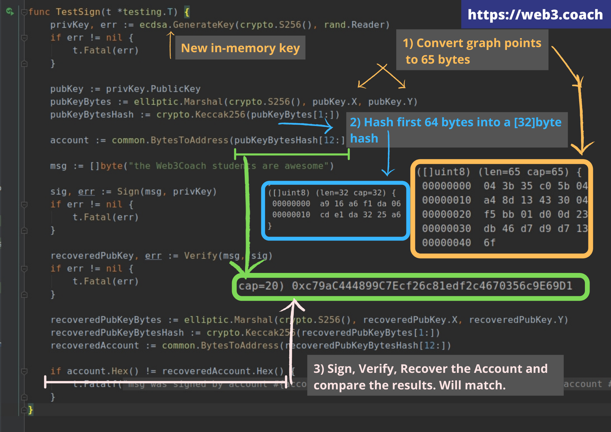

# The Blockchain Bar
> Build a custom blockchain in Go from scratch.

The source-code for the first 7 chapters of: "The Blockchain Way of Programming".

Download the eBook from: https://web3.coach


## Foreword

I can't promise the blockchain way of programming will be easy, but this eBook will turn you into a blockchain developer, expand your career prospects, and open you up to a whole new community of amazing forward thinkers.

## What will you build?

Chapter by chapter, you will build a full peer-to-peer, autonomous blockchain system in Go and **learn all standard blockchain components!**

### 1) You will build a peer-to-peer system from scratch

You start with 0 lines of code and end-up with 13+ branches with complete executable source-code.

PS: Don't worry if anything on the screen makes sense yet, it will once you go chapter by chapter; release by release.


### 2) You will secure the system with a day-to-day practical cryptography

No boring theory. Only modern practices.


### 3) You will implement Bitcoin, Ethereum and XRP backend components 

From diagrams of mining algorithms to actual, implemented and working crypto wallets for storing the mined tokens and all other fundamental components that make blockchain special.


### 4) You will write unit tests and integration tests for all core components

You will test your cryptographic functions, a Bitcoin's like Proof of Work mining algorithm and other key components.



## How to use this repository
Every eBook chapter has a dedicated branch where you can experiment with the code first-hand.

```git
git branch

> c1_genesis_json
> c2_db_changes_txt
> c3_state_blockchain_component
> c4_caesar_transfer
> c5_broken_trust
> c6_immutable_hash
```

## Installation

[Open instructions.](./Installation.md)

## Getting started
1. Open the eBook at Chapter 1
1. Checkout the first chapter's branch

```git
git pull --all

git checkout c1_genesis_json
```

## TBB program usage
### CLI
Interacting with TBB blockchain using CLI.

### Show current program's version
```bash
tbb help
```

### Show blockchain balances of all bar's customers
```bash
tbb balances list
```

### Store a new TX in the DB
```bash
tbb tx add --from=andrej --to=babayaga --value=1000
```

### Store a new Reward TX in the DB
```bash
tbb tx add --from=andrej --to=andrej --value=100 --data=reward
```

## Getting unstuck
Can't understand why is something done in a particular way or crack your way around a specific chapter's topic?

Blockchain is a challenging technology.
   
Write me a DM on LinkedIn or create a Github Issue, and I will help you move forward on your new blockchain journey!
   
[https://www.linkedin.com/in/llukac](https://www.linkedin.com/in/llukac)
